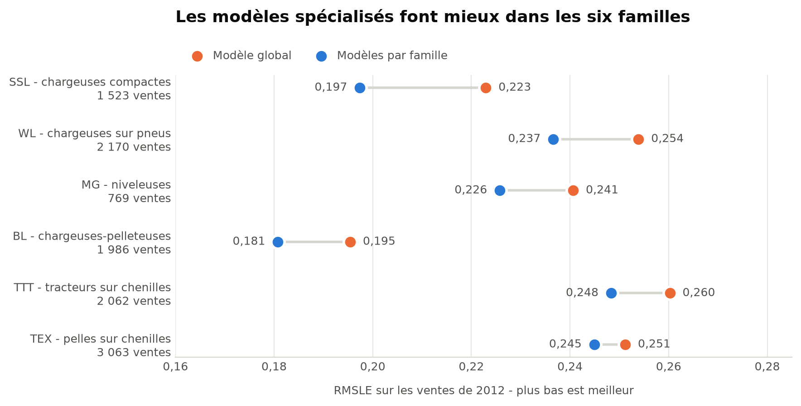

# Blue Book for Bulldozers

### Estimation du prix des engins de chantier d'occasion

`Python 3.12` · `pandas` · `scikit-learn` · `CatBoost` · `unittest` · `JupyterLab` · `Git`

Ce projet de data science prédit le prix de vente aux enchères d'engins de chantier d'occasion à partir de leurs caractéristiques et de la date de vente, sur la base de la compétition Kaggle [« Blue Book for Bulldozers »](https://www.kaggle.com/competitions/bluebook-for-bulldozers/data).

**État actuel du dépôt :** l'étape de préparation des données (notebook 01, `src/preparation_03.py`, `src/fonctions_preparation_03.py`), l'étude comparant les représentations A/B des absences puis la segmentation par famille (notebook 02, `src/experiences_02.py`), la synthèse des expériences (notebook 03 : comparaison des baselines, comparaison global/segmenté, sélection de la méthode et de l'architecture par triangulation de critères fixés à l'avance), l'entraînement final et l'évaluation sur les ventes de 2012 (notebook 04) ainsi que la comparaison exploratoire avec des modèles spécialisés par famille sur ce même test (notebook 05) sont poussés et testés.



## Résultats

Le modèle final (méthode A, CatBoost global, `ProductGroup` comme variable catégorielle parmi les autres) est entraîné sur toutes les ventes antérieures à 2012 et évalué sur les 11 573 ventes de 2012, jamais vues avant cette évaluation :

| Architecture | RMSLE test 2012 |
|---|---:|
| CatBoost global (retenu pour la production) | 0,24043 |
| CatBoost spécialisé par famille (exploratoire) | 0,22689 |

Le notebook 03 avait, selon son protocole prédictif fixé à l'avance, sélectionné l'architecture segmentée. Le notebook 04 retient malgré tout le **global** pour cette première version : c'est un arbitrage d'exploitation, pas un désaccord avec le résultat prédictif - un seul modèle à versionner, réentraîner et surveiller, contre six spécialistes et un modèle de repli. Le notebook 05 confirme, sur le test 2012 réel, que la segmentation aurait fait mieux dans les six familles (réduction relative du RMSLE de 5,63 %), sans remplacer la décision d'exploitation déjà prise.

## Préparation des données

La préparation construit les variables utilisées par les modèles à partir du CSV brut : traitement des identifiants (`datasource`, `auctioneerID`), extraction de spécifications techniques, création de variables de date, d'âge et d'heures par an, regroupement des catégories rares, et imputation des valeurs manquantes ou hors bornes.

Les années de fabrication antérieures à 1950 ou postérieures à la vente sont rendues manquantes, puis imputées ; les ventes correspondantes sont conservées. Les heures nulles ou hors de l'intervalle ]0 ; 40 000] sont également rendues manquantes avant imputation. La division par un âge nul est évitée. Les **médianes, fréquences et regroupements de catégories sont appris uniquement sur l'apprentissage de chaque découpage**, puis appliqués aux ventes à prédire : c'est le mécanisme qui empêche toute fuite entre apprentissage et validation.

Deux traitements catégoriels sont comparés :

- **A** : les valeurs manquantes deviennent la modalité `Missing`.
- **B** : étend A en distinguant, via `variable_nan_structurel()`, les absences structurelles concentrées dans certains `ProductGroup` (encodées `Absent dans ce segment`).

`src/preparation_03.py` industrialise ces traitements dans `Preparation03`, une classe `BaseEstimator`/`TransformerMixin` scikit-learn : les statistiques sont apprises dans `fit()` et appliquées dans `transform()`. `src/fonctions_preparation_03.py` contient les fonctions autonomes utilisées par l'étude notebook.

## Organisation du dépôt

| Fichier | Rôle |
|---|---|
| [01 : Préparation](notebooks/01%20-%20Preparation.ipynb) | Étude : exploration et traitements A/B, cellule par cellule |
| [02 : Expériences](notebooks/02%20-%20Experiences.ipynb) | Étude : comparaison A/B des absences et segmentation par `ProductGroup`, cellule par cellule |
| [03 : Synthèse des expériences](notebooks/03%20-%20Synthese%20des%20experiences.ipynb) | Étude : baselines, comparaison global/segmenté, sélection de la méthode et de l'architecture par triangulation de critères fixés à l'avance |
| [04 : Modélisation finale](notebooks/04%20-%20Modelisation%20finale.ipynb) | Entraînement du modèle retenu sur tout l'historique antérieur à 2012 et évaluation sur le test 2012 |
| [05 : Modélisation segmentée](notebooks/05%20-%20Modelisation%20segmentee.ipynb) | Comparaison exploratoire, sur le même test 2012, avec des modèles spécialisés par famille |
| [src/experiences_02.py](src/experiences_02.py) | Industrialisation : `check_split`, `fit_pair`, `architecture_gain` |
| [src/preparation_03.py](src/preparation_03.py) | Industrialisation : classe `Preparation03` (`fit`/`transform`) |
| [src/fonctions_preparation_03.py](src/fonctions_preparation_03.py) | Fonctions autonomes utilisées par l'étude notebook |
| [tests/](tests/) | Contrôles de non-fuite, d'équivalence des formats d'identifiants, de garde-fous temporels et de routage par segment |

## Reproduire

Environnement utilisé : **Python 3.12 sous Windows**. Les versions des bibliothèques sont dans [requirements.txt](requirements.txt).

1. Télécharger `TrainAndValid.csv` depuis la page Kaggle et le placer dans `data/raw/bluebook-for-bulldozers/`.
2. Depuis la racine du dépôt, créer l'environnement et installer les dépendances :

```powershell
py -3.12 -m venv .venv
.\.venv\Scripts\python.exe -m pip install -r requirements.txt
.\.venv\Scripts\python.exe -m unittest discover -s tests -v
.\.venv\Scripts\python.exe -m jupyterlab
```

3. Choisir le noyau de cet environnement, puis exécuter les notebooks dans cet ordre :
   1. **01 : Préparation** - d'abord avec `FENETRE = "principal"`, puis avec `FENETRE = "confirmation"` (écrit la préparation dans `resultats/notebooks_03/<fenetre>/`, relue par le notebook 02).
   2. **02 : Expériences** - relit la préparation des deux fenêtres, compare les traitements A/B et la segmentation par famille.
   3. **03 : Synthèse des expériences** - recharge le CSV brut de façon autonome (pas de dépendance aux notebooks 01/02), sélectionne la méthode et l'architecture.
   4. **04 : Modélisation finale** - entraîne le modèle retenu et l'évalue sur 2012 (écrit dans `resultats/modele_final_global_A/`, relu par le notebook 05).
   5. **05 : Modélisation segmentée** - relit les résultats du notebook 04 et les compare à des modèles spécialisés par famille.

Les données brutes sont exclues de Git.

## Limites connues

- Pas de recherche systématique d'hyperparamètres (grille, `RandomizedSearchCV`) : les paramètres CatBoost sont fixés après quelques essais manuels dans le notebook 03. Choix assumé : le coût de calcul (plusieurs modèles par famille) rendrait une recherche systématique coûteuse pour un gain probablement sous le seuil de bruit du projet (0,002).
